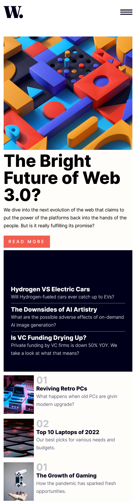
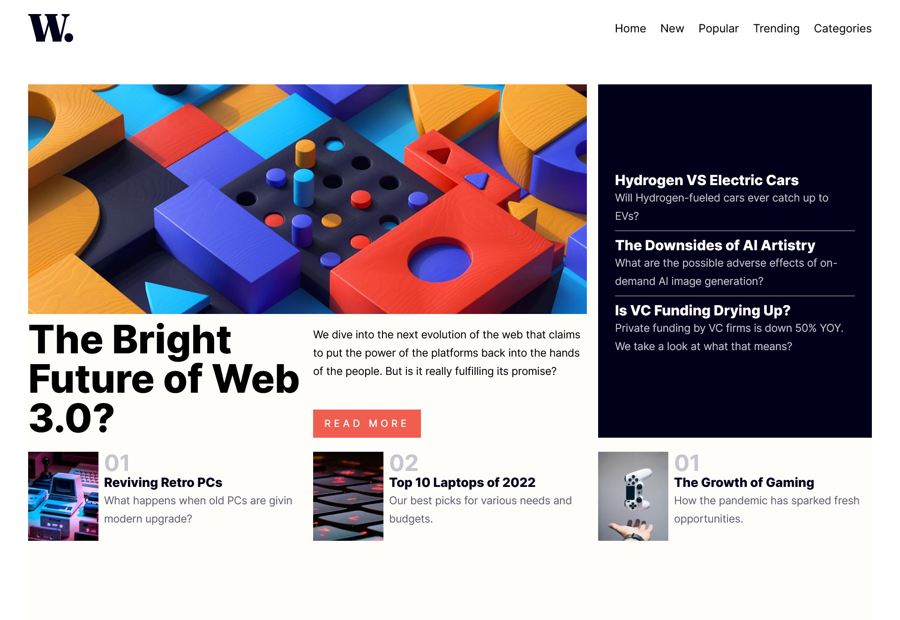

# Frontend Mentor - Single-page design portfolio solution

This is a solution to the [News homepage challenge on Frontend Mentor](https://www.frontendmentor.io/challenges/news-homepage-H6SWTa1MFl). Frontend Mentor challenges help you improve your coding skills by building realistic projects.

## Table of contents

- [Screenshot](#screenshot)
- [Links](#links)
- [Built with](#built-with)
- [What I learned](#what-i-learned)
- [Author](#author)

### Screenshot

### Links

- Solution URL: [Single-page design portfolio](https://github.com/sonny-coding/news-homepage-tailwind)
- Live Site URL:

### Built with

- Mobile-first workflow
- Vite
- Tailwindcss
- CSS Grid

### What I learned

- Mobile-first workflow

### Author

- Github - [sonny-coding](https://github.com/sonny-coding)
- Twitter - [@sonnyConnect](https://twitter.com/sonnyConnect)
